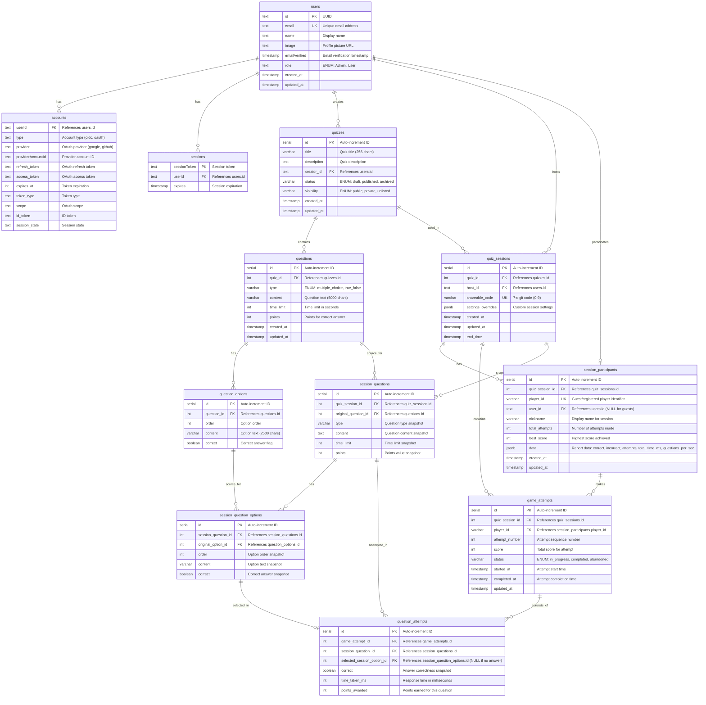
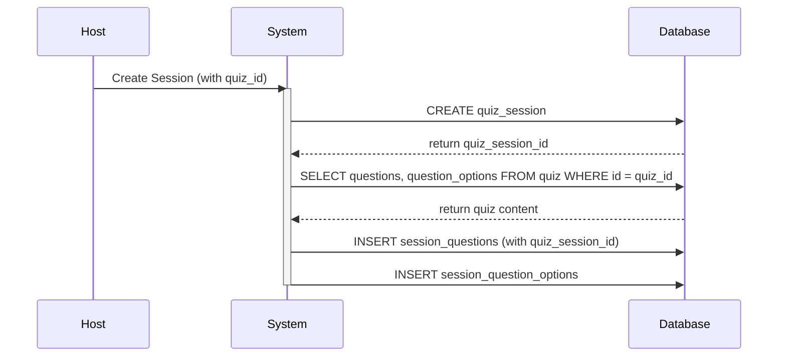
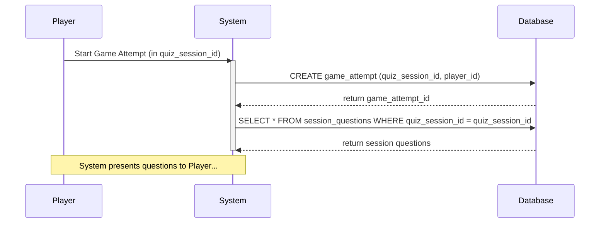
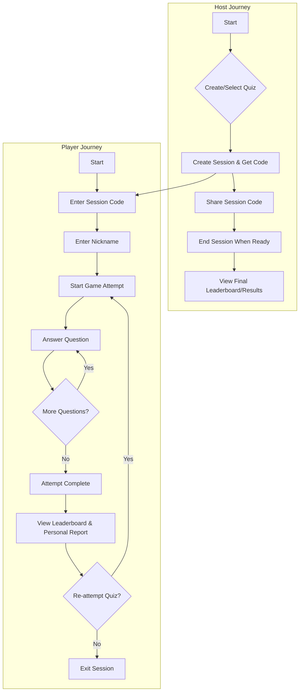

# Plan dự án

## 1. Giới thiệu chung (Overview)

Dự án này nhằm mục đích phát triển một ứng dụng web trắc nghiệm tương tác (Quiz Web App) tương tự như Quizizz, Kahoot. Ứng dụng sẽ được xây dựng bằng SvelteKit, cho phép người dùng tạo, quản lý và tham gia các bài quiz.

## 2. Mục tiêu dự án (Project Goals)

- Phát triển một nền tảng trắc nghiệm trực tuyến đa năng, dễ sử dụng.
- Cung cấp các tính năng tạo trắc nghiệm linh hoạt cho người dùng.
- Mang lại trải nghiệm làm trắc nghiệm thú vị và có tính tương tác cao.
- Đảm bảo hệ thống hoạt động ổn định và có khả năng mở rộng.

## 3. Phạm vi dự án (Project Scope)

### Core Features (In-Scope):

- **Quản lý người dùng:** Đăng ký, đăng nhập, phân quyền (User, Admin).
- **Tạo và quản lý Quiz:**
  - Tạo quiz với câu hỏi trắc nghiệm nhiều lựa chọn và đúng/sai.
  - Thêm hình ảnh vào câu hỏi.
  - Thiết lập thời gian, điểm số cho câu hỏi.
  - Chỉnh sửa, xóa quiz.
- **Tham gia Quiz:**
  - Người tham gia có thể bắt đầu bất cứ lúc nào, làm lại nhiều lần đến khi hết hạn
  - Người dùng tham gia quiz qua link chia sẻ hoặc mã mời.
  - Trả lời câu hỏi trong thời gian giới hạn.
  - Xem kết quả và lịch sử các lần làm bài.
- **Dashboard cho người tạo quiz:**
  - Active Sessions: Xem các self-paced sessions đang hoạt động
  - Thống kê chi tiết cho từng session
- **Xem kết quả:**
  - Người tạo quiz xem thống kê đơn giản.

### Tính năng phát triển sau:

- **Live Quiz (Kahoot-style):** Host đợi ít nhất 1 người tham gia, tất cả làm bài đồng thời
- WebSocket integration cho real-time features
- Lobby system và synchronized gameplay
- Real-time leaderboards
- Câu hỏi điền từ ngắn (Short Answer)
- Báo cáo chi tiết và xuất file
- AI tạo quiz tự động

## 4. Công nghệ sử dụng (Tech Stack)

- **Frontend & Backend:** SvelteKit
- **Ngôn ngữ:** TypeScript
- **Database:** PostgreSQL with Drizzle ORM
- **Authentication:** Auth.js với Google OAuth Provider
- **OAuth Provider:** Google OAuth 2.0
- **Styling:** CSS thuần hoặc TailwindCSS
- **Deployment:** Docker via Coolify

# SRS: Phân tích yêu cầu và đặc tả

## 1. Yêu cầu chức năng (Functional Requirements)

### FR1: Quản lý người dùng

- **FR1.1:** Đăng nhập bằng Google OAuth - người dùng sử dụng tài khoản Google để xác thực.
- **FR1.2:** Tự động tạo tài khoản người dùng mới khi đăng nhập lần đầu qua Google OAuth.
- **FR1.3:** Đăng xuất và quản lý thông tin cá nhân (tên hiển thị, ảnh đại diện từ Google).
- **FR1.4:** Phân quyền: Hệ thống chỉ có 2 vai trò:
  - **User:** Có quyền tạo, quản lý quiz của riêng mình và tham gia vào các quiz khác.
  - **Admin:** Có quyền quản lý toàn bộ hệ thống, bao gồm tất cả người dùng và quiz.
- **FR1.5:** Hệ thống lưu trữ thông tin từ Google: email, tên, ảnh đại diện.

### FR2: Quản lý Quiz

- **FR2.1:** Tạo quiz mới với tiêu đề và mô tả.
- **FR2.2:** Thêm câu hỏi vào quiz:
  - Câu hỏi trắc nghiệm nhiều lựa chọn (2-5 đáp án)
  - Câu hỏi Đúng/Sai
- **FR2.3:** Thêm hình ảnh cho câu hỏi.
- **FR2.4:** Thiết lập thời gian và điểm số cho câu hỏi.
- **FR2.5:** Xem, chỉnh sửa, xóa quiz đã tạo.
- **FR2.6:** Tạo link chia sẻ cho quiz.

### FR3: Tham gia Quiz - Self-Paced

- **FR3.1:** Host tạo Self-Paced session và thiết lập thời gian kết thúc.
- **FR3.2:** Người tham gia có thể bắt đầu bất cứ lúc nào khi họ ấn start.
- **FR3.3:** Cho phép làm lại nhiều lần cho đến khi hết thời gian.
- **FR3.4:** Lưu tất cả lần thử và hiển thị lịch sử để so sánh (chỉ dành cho registered users).
- **FR3.5:** Người tham gia có thể xem báo cáo chi tiết các lần làm bài.
- **FR3.6:** Tham gia quiz bằng link chia sẻ hoặc mã mời.
- **FR3.7:** Nhập nickname để tham gia (guest participation).
- **FR3.8:** Xem câu hỏi và trả lời trong thời gian quy định.
- **FR3.9:** Xem tổng kết điểm số sau khi hoàn thành.
- **FR3.10 (Mới):** Guest Player Behavior:
  - Người chơi không cần đăng nhập có thể tham gia bằng nickname.
  - Dữ liệu của Guest (điểm số, các lần thử) chỉ được lưu trong phạm vi của `Quiz Session` và có thể bị xóa sau khi session kết thúc. Lịch sử làm bài không được lưu trữ lâu dài cho guest.

### FR4: Active Sessions Dashboard

- **FR4.1:** Người tạo quiz xem danh sách các self-paced sessions đang hoạt động.
- **FR4.2:** Hiển thị thông tin session: Tên quiz, trạng thái (Active/Expired), thời gian kết thúc, số người tham gia.
- **FR4.3:** Nút "View Details" để xem thống kê chi tiết từng session.
- **FR4.4:** Khả năng gia hạn thời gian hoặc kết thúc session sớm.

### FR5: Báo cáo cơ bản

- **FR5.1:** Người tạo quiz xem kết quả tổng quan: số người tham gia, điểm trung bình.
- **FR5.2:** Người dùng xem lịch sử các quiz đã tham gia và điểm số.
- **FR5.3:** Thống kê chi tiết cho active sessions: danh sách người tham gia, số lần thử, điểm cao nhất.

## 2. Yêu cầu phi chức năng (Non-Functional Requirements)

- **NFR1: Performance:** Thời gian tải trang, phản hồi nhanh.
- **NFR2: Security:** Google OAuth 2.0 authentication, bảo vệ chống XSS/CSRF, sử dụng HTTPS.
- **NFR3: Usability:** Giao diện trực quan, thông báo lỗi rõ ràng.

# Thiết kế giao diện

## 1. Nguyên tắc thiết kế

- **Tính nhất quán:** Màu sắc, font chữ, components nhất quán toàn ứng dụng.
- **Tính rõ ràng:** Thông tin dễ hiểu, tránh thuật ngữ phức tạp.
- **Tính đơn giản:** Loại bỏ chi tiết không cần thiết.
- **Phản hồi:** Loading states, success/error messages rõ ràng.
- **Desktop-first Design:** Tối ưu cho trải nghiệm desktop.

## 2. Các màn hình chính (Tóm tắt, không thay đổi)

### 2.1. Trang chủ (`/`) - Chưa đăng nhập

- Header với logo, navigation
  - "Sign in" button chuyển đến `/signin`
  - Enter Code to join button
- Hero section
- Features overview
- Footer

### 2.2. Authentication (`/signin`)

- Trang đăng nhập với nhiều authentication providers
- Google OAuth button (provider chính hiện tại)
- Placeholder cho các providers khác (GitHub, Facebook, etc.)
- Tự động redirect sau khi xác thực thành công
- Tạo User mới nếu chưa có trong database
- Hiển thị thông tin người dùng sau khi đăng nhập thành công (email, tên, ảnh đại diện)
- Redirect về `/` sau khi đăng nhập thành công

### 2.3. HomePage (`/`) - Sau khi đăng nhập

- Main content:
  - Burger menu (bên phải) với Settings và Logout
  - Enter code to join section in the middle of main content
  - Find a quiz search bar next to logo
  - Dashboard button next to find a quiz search (goto `/dashboard`)
  - Recent activity: Danh sách quiz đã tham gia gần đây

### 2.4. Dashboard (`/dashboard`)

- Sidebar bên trái:
  - Create Quiz button (goto `/quiz/create`)
  - Library (các quiz đã tạo, goto `/library`)
  - Active Sessions (em các self-paced sessions đang hoạt động)
  - Reports (thống kê về các quiz đã tạo)
- Main container:
  - Search bar để tìm quiz
  - Trending Quizzes: Danh sách các quiz đang hot
- Góc phải:
  - Enter code để join quiz
  - Burger menu với:
    - View Profile
    - Settings
    - Logout

### 2.5. Quiz Library (`/library`)

- Sidebar bên trái:
  - Create Quiz button (goto `/quiz/create`)
  - Library (các quiz đã tạo, goto `/library`)
  - Active Sessions
  - Reports
- Main content (3 tab, mặc đinh là Pulished, còn lại là Drafts và Archived)
  - Danh sách quiz đã tạo (dạng cards, list, 1 each row)
  - Mỗi quiz card hiển thị 2 phần:
    - Trái ngoài cùng là cover image
    - Phần bên phải chứa:
      - row 1: Tiêu đề
      - row 2: Người tạo, thời gian từ lần tạo câu hỏi
      - row 3: Số câu hỏi
      - row 3 (góc phải): Play button (start session goto `/play/session/:id`)
  - Click vào quiz card để vào page quiz detail (`/quiz/:id`)

### 2.6. Quiz Detail (`/quiz/:id`)

- Hiển thị thông tin quiz: Tiêu đề, mô tả, người tạo
- Danh sách câu hỏi với số điểm và thời gian
- Buttons: Edit Quiz, Delete Quiz, Start Session
  - Khi ấn Start Session:
    - Thiết lập end time
    - Tạo link chia sẻ `/play/self-paced/:sessionId`

### 2.7. Quiz Editor (`/quiz/edit/:id`)

- Save button (lưu thay đổi)
  - Khi click sẽ lưu quiz và go to `/quiz/:id`
- Return button (trở về dashboard)
- Form thông tin quiz: Tiêu đề
- Danh sách câu hỏi với drag-drop để sắp xếp
- Add Question button
- Question List:
  - Câu hỏi, hình ảnh, đáp án, thời gian, điểm, loại câu hỏi, delete button, edit button

### 2.8. Quiz Question Editor (`/quiz/:id/question/:questionId/edit`)

- Header:
  - Save Question button (ở bên phải)
  - Return button (trở về `/quiz/:id`, ở bên trái)
  - Drop down menu (loại câu hỏi, bên cạnh Return button)
  - Points (bên cạnh Save button)
  - Time (bên cạnh Points)
- Form thông tin câu hỏi (Main Content)
  - Phần điền tên câu hỏi
  - Phần điền đáp án
    - Nếu là multiple choice(min 2, max 5 đáp án)
      - Single correct answer: Checkbox ở bên cạnh câu hỏi (chỉ có 1 đáp án được chọn)
      - Multiple correct answers: Checkbox ở bên cạnh câu hỏi (có thể có nhiều đáp án được chọn)
    - Nếu là True/False(min and max 2 đáp án)
      - checkbox ở bên cạnh câu hỏi (chỉ có 1 đáp án được chọn)
    - Các option(answer) là các input card, placeholder là "Điền đáp án vào đây"
- Sau khi click Save button (goto `/quiz/:id`)

### 2.9. Quiz Session Player

#### 2.9.1. Session Join Flow (`/play/session/:sessionId`)

**Join Session Page:**

- Header: Logo và session info (quiz title, host name)
- Main content:
  - Quiz preview: Tiêu đề, mô tả, số câu hỏi
  - Session status indicator (Active/Expired)
  - Due date: Thời gian kết thúc session
  - Join form:
    - Nickname input (required cho cả guest và registered users)
    - "Join" button (goto `/play/session/:id/player/:playerId`)
- Footer: Session code display và share button

**Session expired state:**

- Hiển thị thông báo session đã hết hạn
- Thống kê tổng quan (nếu có quyền xem)
- Link về trang chủ

#### 2.9.2. Player Dashboard (`/play/session/:sessionId/player/:playerId`)

**Dashboard chính sau khi join:**

- Header:
  - Quiz title và progress indicator
  - Player info (nickname, avatar nếu registered)
  - Session timer (thời gian còn lại)
  - Exit session button
- Main content:
  - Current attempt status card:
    - Attempt number (#1, #2, etc.)
    - Current status (Not Started, In Progress, Completed)
    - Score (nếu đã hoàn thành)
    - Resume/Start button
  - Previous attempts history (nếu có):
    - List của các lần thử trước
    - Score và thời gian hoàn thành
    - "View Details" link cho mỗi attempt
  - Session leaderboard (top 5):
    - Ranking players by best score
    - Anonymous cho guest players (chỉ hiện nickname)

#### 2.9.3. Quiz Attempt Interface (`/play/session/:sessionId/:attemptId`)

**Question View:**

- Header:
  - Progress bar (Question X of Y)
  - Timer countdown (cho câu hỏi hiện tại)
  - Score indicator (tổng điểm hiện tại)
  - Pause/Resume button
  - Exit attempt button (với confirmation)
- Main content:
  - Question display:
    - Question text (with image support)
    - Question type indicator
    - Points available
  - Answer options:
    - Multiple choice: Radio buttons hoặc checkboxes
    - True/False: Two large buttons
    - Visual feedback khi hover/select
  - Navigation:
    - "Previous" button (disabled cho câu đầu tiên)
    - "Next" button / "Submit Answer" button
    - Question navigator (optional, small dots showing progress)

**Auto-save functionality:**

- Tự động lưu câu trả lời khi chọn
- Lưu tiến độ mỗi 30 giây
- Hiển thị "Saving..." indicator khi cần thiết

#### 2.9.4. Results Interface (`/play/attempt/:attemptId/results`)

**Results Summary:**

- Header:
  - "Quiz Completed!" message
  - Final score display (large, prominent)
  - Time taken
  - Accuracy percentage
- Performance breakdown:
  - Questions answered correctly/incorrectly
  - Average time per question
  - Points breakdown by question
- Question-by-question review:
  - List tất cả câu hỏi với:
    - Question text (truncated)
    - Your answer vs Correct answer
    - Points earned/lost
    - Time taken
    - "Review" button để xem chi tiết
- Action buttons:
  - "Try Again" (nếu session chưa hết hạn)
  - "View All Attempts" (so sánh với các lần thử trước)
  - "Share Results" (social sharing)
  - "Back to Dashboard"

#### 2.9.5. Question Review Modal (`/play/attempt/:attemptId/question/:questionId`)

**Detailed Question Review:**

- Modal overlay hoặc dedicated page
- Full question display với image
- All answer options với indicators:
  - Your selection (highlighted)
  - Correct answer (green checkmark)
  - Incorrect options (red X)
- Explanation section (nếu có)
- Statistics:
  - Time taken for this question
  - Points earned
  - Difficulty indicator
- Navigation:
  - Previous/Next question buttons
  - Close modal button

#### 2.9.6. Attempt History (`/play/session/:sessionId/player/:playerId/history`)

**All Attempts Overview:**

- Header: Player stats summary
  - Total attempts
  - Best score
  - Average score
  - Time spent
- Attempts timeline:
  - Chronological list của tất cả attempts
  - Each attempt card shows:
    - Attempt number và timestamp
    - Score và accuracy
    - Time taken
    - Status (Completed/Abandoned)
    - "View Details" button
- Comparison charts:
  - Score progression over attempts
  - Time improvement graph
  - Accuracy trends

#### 2.9.7. Error States và Edge Cases

**Connection issues:**

- Offline mode với local storage backup
- Auto-retry mechanism
- "Connection lost" indicator
- Resume capability khi reconnect

**Session expiry during attempt:**

- Warning notifications trước khi hết hạn
- Grace period để hoàn thành câu hỏi hiện tại
- Auto-submit khi hết thời gian

**Invalid states:**

- Session not found (404)
- Player not authorized
- Attempt already completed
- Browser back button handling

**Routing Structure Summary:**

```
/play/session/:sessionId                          # Session join page
/play/session/:sessionId/player/:playerId         # Player dashboard
/play/attempt/:attemptId                          # Quiz taking interface
/play/attempt/:attemptId/results                  # Results summary
/play/attempt/:attemptId/question/:questionId     # Question review
/play/session/:sessionId/player/:playerId/history # Attempt history
```

## 3. Active Sessions Page (`/sessions`)

- Hiển thị danh sách các sessions đang hoạt động dưới dạng cards.
- Mỗi card hiển thị:
  - Tên quiz
  - Trạng thái (Active/Expired)
  - Thời gian kết thúc
  - Số người tham gia
  - Link chia sẻ (với nút copy)
- Ấn vô session card để chuyển đến `/play/session/:sessionId`
  - hiện thị danh sách người tham gia
  - Input điền tên và join

# Database Design

## Entity Relationship Diagram



## 4. Data Flow Diagrams

### 4.1. Session Creation & Question Snapshotting Flow



### 4.2. Player Game Attempt Flow



## 5. User Flow Diagram



# Folder Architecture

The project follows SvelteKit's conventional folder structure with additional organization for database and authentication:

- `src/`: Contains the source code of the application.
  - `app.html`: The main HTML file for the application.
  - `app.css`: Global styles for the application.
  - `app.d.ts`: TypeScript ambient declarations.
  - `auth.ts`: Authentication logic.
  - `hooks.server.ts`: Server-side hooks.
  - `lib/`: Contains reusable components and utilities.
    - `components/`: Contains reusable Svelte components.
      - Example: QuizCard.svelte, Question.svelte
    - `stores/`: Contains Svelte stores for managing application state.
      - Example: userStore.ts, quizStore.ts
    - `utils/`: Contains utility functions.
      - Example: dateUtils.ts, formatUtils.ts
    - `index.ts`: Exports reusable components and utilities.
    - `server/`: Server-side specific code.
      - `role-utils.ts`: Role management utilities.
      - `db/`: Database related code.
        - `index.ts`: Database connection and initialization.
        - `schema.ts`: Database schema definition.
  - `routes/`: Defines the application's routes.
    - `+layout.server.ts`: Server-side layout logic.
    - `+layout.svelte`: The main layout for the application.
    - `+page.svelte`: The main page for the application.
    - `admin/`: Admin routes.
      - `+page.server.ts`: Server-side logic for the admin page.
      - `+page.svelte`: The admin page.
    - `signin/`: Sign-in routes.
      - `+page.server.ts`: Server-side logic for the sign-in page.
      - `+page.svelte`: The sign-in page.
- `static/`: Contains static assets such as images and fonts.
  - `favicon.png`: The application's favicon.
  - `github.svg`: GitHub logo.
  - `google.svg`: Google logo.
  - `quiz-learn-logo.png`: Quiz Learn logo.
- `drizzle/`: Contains database migration files.
- Other files:
  - `.env.example`: Example environment variables.
  - `.gitignore`: Specifies intentionally untracked files that Git should ignore.
  - `svelte.config.js`: SvelteKit configuration file.
  - `vite.config.ts`: Vite configuration file.
  - `tsconfig.json`: TypeScript configuration file.
  - `package.json`: Node.js package manifest file.
