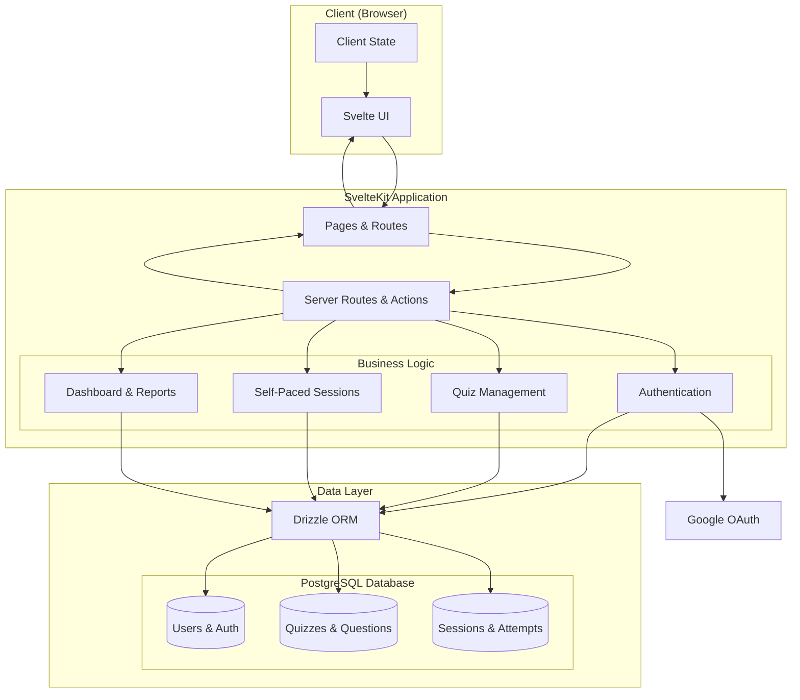

# Thiết kế chương trình

## 1. Kiến trúc hệ thống

### 1.1. Tổng quan

- **SvelteKit Monolith:** Frontend và Backend trong cùng một project
- **Client-Side Rendering:** Tận dụng SvelteKit's CSR capabilities
- **API Routes:** SvelteKit server routes xử lý business logic
- **PostgreSQL:** Relational database với Drizzle ORM cho type-safety



### 1.2. Simplified Architecture Components

**Client Layer:**

- **Svelte UI:** User interface components and interactions
- **Client State:** Application state management using Svelte stores

**SvelteKit Application:**

- **Pages & Routes:** SvelteKit routing and page components
- **Server Routes & Actions:** Server-side logic and form handling
- **Business Logic Modules:**
  - **Authentication:** User login/logout and session management
  - **Quiz Management:** CRUD operations for quizzes and questions
  - **Self-Paced Sessions:** Session creation and attempt tracking
  - **Dashboard & Reports:** Statistics and monitoring interface

**Data Layer:**

- **Drizzle ORM:** Type-safe database access layer
- **PostgreSQL Database:** Three logical table groups for users, quizzes, and sessions

**External Services:**

- **Google OAuth:** Authentication provider

## 2. Thiết kế Cơ sở dữ liệu (Database Design)

### 2.1. Các Bảng Chính (PostgreSQL với Drizzle ORM)

**`users` table:**

```typescript
export const users = pgTable("users", {
	id: serial("id").primaryKey(),
	email: varchar("email", { length: 255 }).notNull().unique(),
	googleId: varchar("google_id", { length: 255 }).notNull().unique(),
	displayName: varchar("display_name", { length: 255 }).notNull(),
	googlePicture: text("google_picture"),
	role: varchar("role", { length: 50 }).notNull().default("USER"), // 'USER' | 'ADMIN'
	createdAt: timestamp("created_at").notNull().defaultNow(),
	updatedAt: timestamp("updated_at").notNull().defaultNow()
})

// Indexes:
// CREATE UNIQUE INDEX idx_users_email ON users(email);
// CREATE UNIQUE INDEX idx_users_google_id ON users(google_id);
```

**`quizzes` table:**

```typescript
export const quizzes = pgTable("quizzes", {
	id: serial("id").primaryKey(),
	title: varchar("title", { length: 200 }).notNull(),
	description: text("description"),
	creatorId: integer("creator_id")
		.notNull()
		.references(() => users.id, { onDelete: "cascade" }),
	status: varchar("status", { length: 50 }).notNull().default("DRAFT"), // 'DRAFT' | 'PUBLISHED'
	visibility: varchar("visibility", { length: 50 }).notNull().default("PRIVATE"), // 'PRIVATE' | 'PUBLIC'

	// Self-paced settings as JSON column
	selfPacedSettings: jsonb("self_paced_settings").notNull().default({
		allowRetakes: true,
		saveAllAttempts: true,
		showCorrectAnswers: "AFTER_ATTEMPT" // 'INSTANTLY' | 'AFTER_ATTEMPT' | 'AFTER_SESSION_END'
	}),

	createdAt: timestamp("created_at").notNull().defaultNow(),
	updatedAt: timestamp("updated_at").notNull().defaultNow()
})

// Indexes:
// CREATE INDEX idx_quizzes_creator_created ON quizzes(creator_id, created_at DESC);
// CREATE INDEX idx_quizzes_status_visibility ON quizzes(status, visibility);
```

**`questions` table:**

```typescript
export const questions = pgTable("questions", {
	id: serial("id").primaryKey(),
	quizId: integer("quiz_id")
		.notNull()
		.references(() => quizzes.id, { onDelete: "cascade" }),
	orderIndex: integer("order_index").notNull(),
	type: varchar("type", { length: 50 }).notNull(), // 'MULTIPLE_CHOICE' | 'TRUE_FALSE'
	content: text("content").notNull(),
	mediaUrl: text("media_url"),
	timeLimitSeconds: integer("time_limit_seconds").notNull().default(30),
	points: integer("points").notNull().default(10),
	createdAt: timestamp("created_at").notNull().defaultNow(),
	updatedAt: timestamp("updated_at").notNull().defaultNow()
})

// Indexes:
// CREATE INDEX idx_questions_quiz_order ON questions(quiz_id, order_index);
```

**`question_options` table:**

```typescript
export const questionOptions = pgTable("question_options", {
	id: serial("id").primaryKey(),
	questionId: integer("question_id")
		.notNull()
		.references(() => questions.id, { onDelete: "cascade" }),
	orderIndex: integer("order_index").notNull(),
	content: varchar("content", { length: 500 }).notNull(),
	isCorrect: boolean("is_correct").notNull().default(false),
	createdAt: timestamp("created_at").notNull().defaultNow()
})

// Indexes:
// CREATE INDEX idx_options_question_order ON question_options(question_id, order_index);
```

**`game_sessions` table:**

```typescript
export const gameSessions = pgTable("game_sessions", {
	id: serial("id").primaryKey(),
	quizId: integer("quiz_id")
		.notNull()
		.references(() => quizzes.id, { onDelete: "cascade" }),
	hostId: integer("host_id")
		.notNull()
		.references(() => users.id, { onDelete: "cascade" }),
	shareableId: varchar("shareable_id", { length: 12 }).notNull().unique(),

	mode: varchar("mode", { length: 50 }).notNull().default("SELF_PACED"), // 'SELF_PACED' | 'LIVE'
	status: varchar("status", { length: 50 }).notNull().default("ACTIVE"), // 'ACTIVE' | 'EXPIRED' | 'ENDED_BY_HOST'

	endTime: timestamp("end_time").notNull(),

	// Settings overrides as JSON
	settingsOverrides: jsonb("settings_overrides"),

	createdAt: timestamp("created_at").notNull().defaultNow(),
	updatedAt: timestamp("updated_at").notNull().defaultNow()
})

// Indexes:
// CREATE UNIQUE INDEX idx_sessions_shareable_id ON game_sessions(shareable_id);
// CREATE INDEX idx_sessions_host_created ON game_sessions(host_id, created_at DESC);
// CREATE INDEX idx_sessions_quiz_status ON game_sessions(quiz_id, status);
// CREATE INDEX idx_sessions_status_end_time ON game_sessions(status, end_time);
```

**`session_participants` table:**

```typescript
export const sessionParticipants = pgTable("session_participants", {
	id: serial("id").primaryKey(),
	gameSessionId: integer("game_session_id")
		.notNull()
		.references(() => gameSessions.id, { onDelete: "cascade" }),
	playerId: varchar("player_id", { length: 255 }).notNull(), // UUID for guests, user_id for registered users
	nickname: varchar("nickname", { length: 50 }).notNull(),
	isGuest: boolean("is_guest").notNull().default(true),
	userId: integer("user_id").references(() => users.id, { onDelete: "set null" }), // null for guests
	totalAttempts: integer("total_attempts").notNull().default(0),
	bestScore: integer("best_score").notNull().default(0),
	lastActivity: timestamp("last_activity").notNull().defaultNow(),
	createdAt: timestamp("created_at").notNull().defaultNow()
})

// Indexes:
// CREATE UNIQUE INDEX idx_participants_session_player ON session_participants(game_session_id, player_id);
// CREATE INDEX idx_participants_session ON session_participants(game_session_id);
```

**`game_attempts` table:**

```typescript
export const gameAttempts = pgTable("game_attempts", {
	id: serial("id").primaryKey(),
	gameSessionId: integer("game_session_id")
		.notNull()
		.references(() => gameSessions.id, { onDelete: "cascade" }),
	playerId: varchar("player_id", { length: 255 }).notNull(),
	attemptNumber: integer("attempt_number").notNull(),

	startedAt: timestamp("started_at").notNull().defaultNow(),
	completedAt: timestamp("completed_at"),
	score: integer("score").notNull().default(0),
	status: varchar("status", { length: 50 }).notNull().default("IN_PROGRESS"), // 'IN_PROGRESS' | 'COMPLETED' | 'ABANDONED'

	createdAt: timestamp("created_at").notNull().defaultNow(),
	updatedAt: timestamp("updated_at").notNull().defaultNow()
})

// Indexes:
// CREATE UNIQUE INDEX idx_attempts_session_player_number ON game_attempts(game_session_id, player_id, attempt_number);
// CREATE INDEX idx_attempts_session_created ON game_attempts(game_session_id, created_at DESC);
// CREATE INDEX idx_attempts_player_created ON game_attempts(player_id, created_at DESC);
```

**`attempt_answers` table:**

```typescript
export const attemptAnswers = pgTable("attempt_answers", {
	id: serial("id").primaryKey(),
	attemptId: integer("attempt_id")
		.notNull()
		.references(() => gameAttempts.id, { onDelete: "cascade" }),
	questionId: integer("question_id")
		.notNull()
		.references(() => questions.id, { onDelete: "cascade" }),
	selectedOptionId: integer("selected_option_id").references(() => questionOptions.id, {
		onDelete: "set null"
	}),
	questionIndex: integer("question_index").notNull(),
	isCorrect: boolean("is_correct").notNull().default(false),
	scoreAwarded: integer("score_awarded").notNull().default(0),
	answeredAt: timestamp("answered_at").notNull().defaultNow(),
	timeTakenMs: integer("time_taken_ms").notNull()
})

// Indexes:
// CREATE INDEX idx_answers_attempt ON attempt_answers(attempt_id);
// CREATE INDEX idx_answers_question ON attempt_answers(question_id);
```

### 2.2. Mối quan hệ và Cải tiến

**Auth.js Schema Relationships:**

- `users` ← `accounts` (one-to-many via `userId`) - OAuth provider accounts
- `users` ← `sessions` (one-to-many via `userId`) - User sessions
- `users` ← `authenticators` (one-to-many via `userId`) - WebAuthn credentials

**Application Schema Relationships:**

- `users` ← `quizzes` (one-to-many via `creator_id`)
- `quizzes` ← `questions` (one-to-many via `quiz_id`)
- `questions` ← `question_options` (one-to-many via `question_id`)
- `quizzes` ← `game_sessions` (one-to-many via `quiz_id`)
- `users` ← `game_sessions` (one-to-many via `host_id`)
- `game_sessions` ← `session_participants` (one-to-many via `game_session_id`)
- `game_sessions` ← `game_attempts` (one-to-many via `game_session_id`)
- `game_attempts` ← `attempt_answers` (one-to-many via `attempt_id`)

**PostgreSQL + Drizzle:**

- **Auth.js Integration**: Full compatibility với Auth.js standard schema cho OAuth authentication
- **Type Safety**: Drizzle ORM cung cấp full TypeScript type safety
- **Relational Integrity**: Foreign key constraints đảm bảo data consistency
- **Guest User Support**: Sử dụng UUID cho `player_id` của guest users, text-based user IDs cho registered users
- **Normalized Schema**: Tách questions và options thành bảng riêng để tối ưu
- **Performance Indexes**: Các index được tối ưu cho PostgreSQL
- **JSON Support**: Sử dụng JSONB cho complex settings và configurations
- **Cascade Deletes**: Tự động cleanup related data khi xóa parent records
- **OAuth Provider Support**: Native support cho Google OAuth thông qua Auth.js accounts table

### 2.3. Database Schema Management với Drizzle

**Drizzle Configuration ([`drizzle.config.ts`](drizzle.config.ts:1)):**

```typescript
import { defineConfig } from "drizzle-kit"

export default defineConfig({
	schema: "./src/lib/server/db/schema.ts",
	dialect: "postgresql",
	dbCredentials: { url: process.env.DATABASE_URL },
	verbose: true,
	strict: true
})
```

**Database Connection ([`src/lib/server/db/index.ts`](src/lib/server/db/index.ts:1)):**

```typescript
import { drizzle } from "drizzle-orm/postgres-js"
import * as schema from "./schema"
import { env } from "$env/dynamic/private"

export const db = drizzle(env.DATABASE_URL, { schema })
```

**Auth.js Drizzle Adapter Configuration:**

```typescript
// src/lib/server/auth.ts
import NextAuth from "next-auth"
import Google from "next-auth/providers/google"
import { DrizzleAdapter } from "@auth/drizzle-adapter"
import { db, users, accounts, sessions, verificationTokens } from "./db/schema"

export const { handlers, auth } = NextAuth({
	adapter: DrizzleAdapter(db, {
		usersTable: users,
		accountsTable: accounts,
		sessionsTable: sessions,
		verificationTokensTable: verificationTokens
	}),
	providers: [
		Google({
			clientId: process.env.GOOGLE_CLIENT_ID,
			clientSecret: process.env.GOOGLE_CLIENT_SECRET
		})
	],
	callbacks: {
		session({ session, user }) {
			// Add custom fields to session
			session.user.id = user.id
			session.user.role = user.role
			return session
		}
	}
})
```

**Essential Indexes (SQL Migration):**

```sql
-- Users table indexes
CREATE UNIQUE INDEX idx_users_email ON users(email);
CREATE UNIQUE INDEX idx_users_google_id ON users(google_id);

-- Quizzes table indexes
CREATE INDEX idx_quizzes_creator_created ON quizzes(creator_id, created_at DESC);
CREATE INDEX idx_quizzes_status_visibility ON quizzes(status, visibility);

-- Questions table indexes
CREATE INDEX idx_questions_quiz_order ON questions(quiz_id, order_index);

-- Question options indexes
CREATE INDEX idx_options_question_order ON question_options(question_id, order_index);

-- Game sessions indexes
CREATE UNIQUE INDEX idx_sessions_shareable_id ON game_sessions(shareable_id);
CREATE INDEX idx_sessions_host_created ON game_sessions(host_id, created_at DESC);
CREATE INDEX idx_sessions_quiz_status ON game_sessions(quiz_id, status);

-- Session participants indexes
CREATE UNIQUE INDEX idx_participants_session_player ON session_participants(game_session_id, player_id);

-- Game attempts indexes
CREATE UNIQUE INDEX idx_attempts_session_player_number ON game_attempts(game_session_id, player_id, attempt_number);
CREATE INDEX idx_attempts_session_created ON game_attempts(game_session_id, created_at DESC);

-- Attempt answers indexes
CREATE INDEX idx_answers_attempt ON attempt_answers(attempt_id);
CREATE INDEX idx_answers_question ON attempt_answers(question_id);
```

**Data Cleanup với PostgreSQL:**

```sql
-- Auto-cleanup expired sessions (requires pg_cron extension)
-- This would typically be handled by application logic or cron jobs
DELETE FROM game_sessions
WHERE status = 'EXPIRED'
  AND end_time < NOW() - INTERVAL '30 days';

-- Cleanup old completed attempts
DELETE FROM game_attempts
WHERE status = 'COMPLETED'
  AND completed_at < NOW() - INTERVAL '90 days';
```

## 3. Các Giai đoạn Phát triển

**Sprint 1-4:** Xác thực, CRUD Quiz, Database Schema
**Sprint 5-7:** Session tự học, API tham gia, UI cơ bản
**Sprint 8-9:** Dashboard, báo cáo, thống kê
**Sprint 10-11:** Tính năng nâng cao, UX/UI improvements
