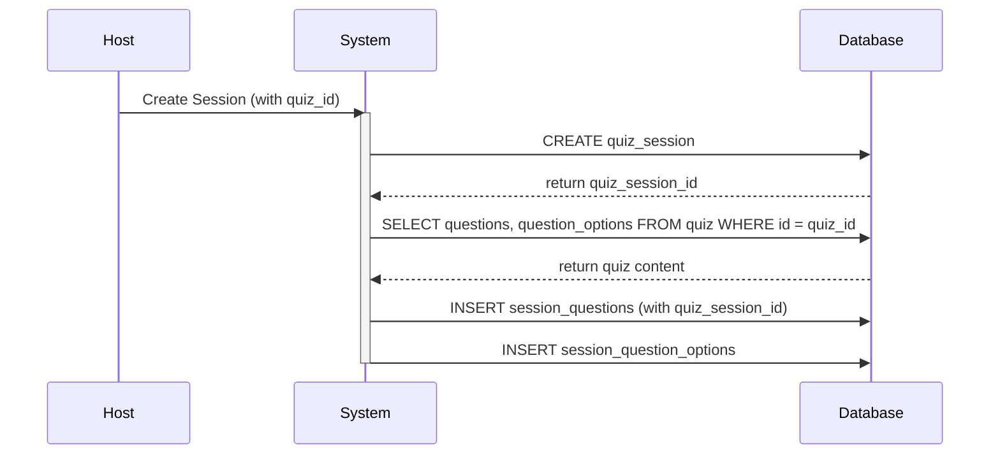
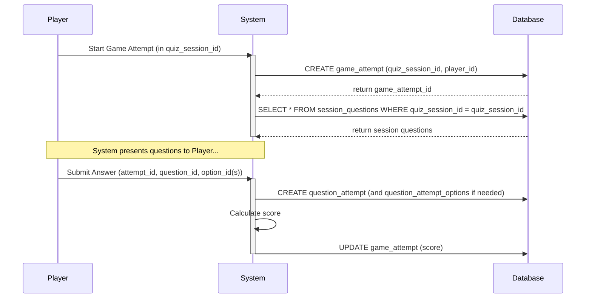
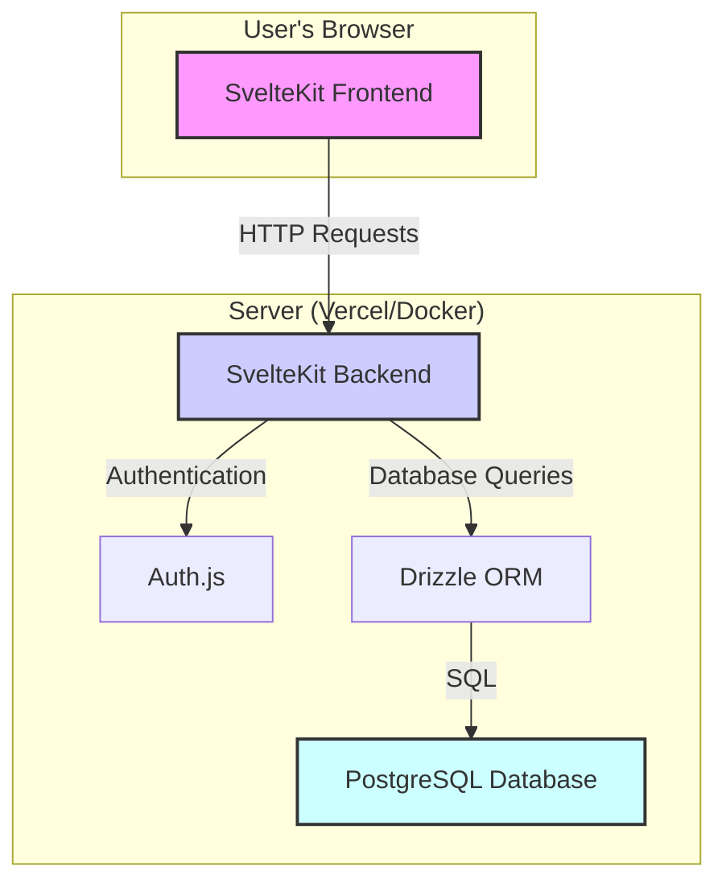

# Báo cáo Dự án: Quiz Learn

## 1. Phân chia công việc chi tiết

### **Tuần 1: Khởi tạo & Core Features**

- **Trần Thành Long (Backend)**

  - Thiết lập project SvelteKit, Drizzle ORM, Auth.js
  - Cấu hình ESLint, Prettier, Husky
  - Hoàn thiện schema DB (Users, Quiz, Questions, Sessions)
  - Logic tạo/quản lý Quiz và Session
  - API cho việc tạo/lấy dữ liệu Quiz
  - API cho việc tham gia Session
  - Hoàn thiện vai trò User/Admin

- **Vương Quang Quý (Quiz UI)**

  - Nghiên cứu thư viện component
  - Dựng layout cơ bản cho trang Quiz Editor
  - Xây dựng form tạo/sửa câu hỏi
  - Giao diện quản lý các lựa chọn (answers)
  - Hoàn thiện Quiz Editor (thêm/sửa/xóa câu hỏi)
  - Giao diện cài đặt Quiz (thời gian, điểm)

- **Nguyễn Xuân Mạnh (Auth/Results UI)**

  - Thiết kế Landing Page
  - Dựng trang đăng nhập với các provider OAuth (Google, Github)
  - Hoàn thiện luồng đăng nhập/đăng xuất
  - Xây dựng trang Profile người dùng
  - Giao diện nhập mã code tham gia
  - Xây dựng sảnh chờ (session lobby)

- **Vũ Văn Sơn (Dashboard/Sessions UI)**
  - Thiết kế layout chính cho Dashboard
  - Tạo Sidebar và Header components
  - Dựng các section chính trên Dashboard (Welcome, Trending)
  - Tích hợp thanh tìm kiếm
  - Xây dựng trang liệt kê Sessions
  - Giao diện chi tiết một Session

### **Tuần 2: Luồng chơi & Báo cáo**

- **Trần Thành Long (Backend)**

  - Logic tính điểm và theo dõi lượt chơi (Attempts)
  - Snapshot Quiz content khi tạo Session
  - Tối ưu query DB
  - API cho trang báo cáo
  - Hoàn thiện Admin panel (quản lý user)
  - Seeding script cho DB

- **Vương Quang Quý (Quiz UI)**

  - Xây dựng giao diện chơi Quiz (hiển thị câu hỏi, timer)
  - Luồng trả lời và chuyển câu hỏi
  - Giao diện hiển thị kết quả sau khi chơi
  - Hoàn thiện các action trên Quiz (Start, Edit, Delete)
  - Thêm chức năng nhân bản Quiz

- **Nguyễn Xuân Mạnh (Auth/Results UI)**

  - Xây dựng trang thư viện Quiz (Library)
  - Thêm bộ lọc, sắp xếp, tìm kiếm cho thư viện
  - Giao diện xem kết quả cá nhân
  - Review lại từng câu trả lời
  - Tối ưu UI/UX cho trang Library và Results

- **Vũ Văn Sơn (Dashboard/Sessions UI)**
  - Giao diện quản lý người tham gia trong Session
  - Xây dựng trang Báo cáo (Reports)
  - Hoàn thiện trang liệt kê Reports
  - Giao diện báo cáo chi tiết theo Session
  - Thêm các biểu đồ/thống kê cơ bản cho trang Reports

### **Tuần 3: Tối ưu & Triển khai**

- **Trần Thành Long (Backend)**

  - Tối ưu hiệu năng backend
  - Logic dọn dẹp session hết hạn
  - Review và vá lỗi bảo mật
  - Viết test (nếu có)
  - Rà soát toàn bộ API
  - Chuẩn bị cho production

- **Vương Quang Quý (Quiz UI)**

  - Tối ưu UI/UX cho Quiz Editor và Player
  - Kiểm thử chéo các luồng Quiz
  - Sửa lỗi UI/UX
  - Hoàn thiện responsive design

- **Nguyễn Xuân Mạnh (Auth/Results UI)**

  - Hoàn thiện responsive trên các giao diện
  - Kiểm thử luồng xác thực và tham gia
  - Sửa lỗi UI/UX
  - Tối ưu performance cho Library và Results

- **Vũ Văn Sơn (Dashboard/Sessions UI)**
  - Tối ưu và hoàn thiện Dashboard
  - Kiểm thử toàn bộ luồng Dashboard và Session
  - Sửa lỗi UI/UX
  - Hoàn thiện tính năng Reports

---

## 2. Phân tích yêu cầu

### a. Đặt vấn đề bài toán

Dự án nhằm mục đích phát triển một ứng dụng web trắc nghiệm tương tác (Quiz Web App) tương tự như Quizizz và Kahoot. Ứng dụng cho phép người dùng tạo, quản lý, chia sẻ và tham gia các bài quiz một cách linh hoạt. Mục tiêu là cung cấp một nền tảng dễ sử dụng, có tính tương tác cao, hoạt động ổn định và có khả năng mở rộng trong tương lai.

### b. Tác nhân, người dùng

Hệ thống có hai vai trò chính:

1.  **User (Người dùng):**
    - **Người tạo Quiz (Host):** Có quyền tạo, quản lý, và chia sẻ các quiz của riêng mình. Họ có thể tạo các "self-paced sessions" và xem báo cáo, thống kê từ các session đó.
    - **Người tham gia (Player):** Có thể tham gia vào các quiz thông qua mã mời hoặc link chia sẻ. Họ có thể là người dùng đã đăng ký (lịch sử được lưu lại) hoặc khách (guest).
2.  **Admin (Quản trị viên):**
    - Có quyền quản lý toàn bộ hệ thống, bao gồm quản lý tất cả người dùng và các quiz được tạo trên nền tảng.

### c. Chức năng, phân tích chức năng (theo tác nhân)

#### Chức năng dành cho User (Host & Player)

- **FR1: Quản lý người dùng**
  - Đăng nhập/Đăng ký bằng tài khoản Google, Github.
  - Tự động tạo tài khoản khi đăng nhập lần đầu.
  - Quản lý thông tin cá nhân cơ bản.
- **FR2: Quản lý Quiz (Host)**
  - Tạo quiz mới với tiêu đề, mô tả.
  - Thêm câu hỏi (trắc nghiệm nhiều lựa chọn, đúng/sai) và hình ảnh.
  - Thiết lập thời gian, điểm số cho từng câu hỏi.
  - Chỉnh sửa, xóa, và quản lý các quiz đã tạo.
- **FR3: Tham gia Quiz (Player)**
  - Tham gia bằng mã mời hoặc link.
  - Có thể tham gia với tư cách khách (guest) bằng nickname.
  - Trả lời câu hỏi trong thời gian giới hạn.
  - Xem kết quả và lịch sử làm bài (chỉ dành cho người dùng đã đăng ký).
  - Được phép làm lại nhiều lần trong các "self-paced sessions" cho đến khi hết hạn.
- **FR4: Dashboard & Active Sessions (Host)**
  - Xem danh sách các session đang hoạt động.
  - Xem thông tin chi tiết: trạng thái, thời gian kết thúc, số người tham gia.
  - Gia hạn hoặc kết thúc session sớm.
- **FR5: Báo cáo (Host & Player)**
  - **Host:** Xem thống kê tổng quan về số người tham gia, điểm trung bình, và hiệu suất của từng người chơi trong session.
  - **Player:** Xem lịch sử các quiz đã tham gia và điểm số của mình.

#### Chức năng dành cho Admin

- **FR1.4: Phân quyền**
  - Quản lý toàn bộ người dùng và quiz trong hệ thống.

---

## 3. Đặc tả và thiết kế chi tiết

### a. Usecase và mô tả

#### 1. Quản lý Quiz (Quiz Management)

**Tác nhân:** Host (User)
**Điều kiện tiên quyết:** Người dùng phải đăng nhập vào hệ thống.

**Luồng công việc:**

- **Tạo Quiz:**

  - Người dùng khởi tạo quá trình tạo quiz từ dashboard, hoặc sidebar (Create Quiz).
  - Hệ thống tự động tạo một quiz mới có tiêu đề "Untitled Quiz" ở trạng thái "draft"
  - Người dùng được chuyển hướng đến trang chỉnh sửa quiz

- **Chỉnh sửa thông tin Quiz:**

  - Cập nhật tiêu đề và mô tả quiz
  - Gán các thẻ (tags) để phân loại quiz
  - Lưu thông tin vào cơ sở dữ liệu

- **Quản lý câu hỏi:**

  - Thêm câu hỏi mới (chuyển đến câu hỏi editor)
  - Chỉnh sửa câu hỏi hiện có
  - Xóa câu hỏi không cần thiết
  - Điều chỉnh thời gian và điểm số cho từng câu hỏi

- **Editor câu hỏi chi tiết:**
  - Nhập nội dung câu hỏi
  - Chọn loại câu hỏi (Trắc nghiệm nhiều lựa chọn hoặc Đúng/Sai)
  - Thiết lập điểm số và thời gian giới hạn
  - Quản lý các lựa chọn trả lời và đánh dấu đáp án đúng

#### 2. Tổ chức Session (Organize Session)

**Tác nhân:** Host (User)
**Điều kiện tiên quyết:**

- Người dùng phải đăng nhập
- Người dùng phải là chủ sở hữu của quiz
- Quiz phải có trạng thái "published"

**Luồng công việc:**

- **Khởi tạo Session:**

  - Host điều hướng đến trang chi tiết quiz của họ
  - Nhấn nút "Start" để bắt đầu một session mới
  - Hệ thống xác thực quyền sở hữu và trạng thái quiz

- **Tạo Session:**

  - Tạo mã tham gia ngẫu nhiên 6 ký tự duy nhất
  - Tạo bản ghi session mới với trạng thái "inactive"
  - Thiết lập thời gian hết hạn mặc định (24 giờ)

- **Snapshot nội dung:**

  - Sao chép tất cả câu hỏi từ quiz gốc vào bảng session_questions
  - Sao chép tất cả lựa chọn trả lời vào bảng session_question_options
  - Đảm bảo nội dung session không bị ảnh hưởng khi quiz gốc thay đổi

- **Chuyển hướng đến quản lý:**
  - Host được chuyển đến trang quản lý session
  - Hiển thị mã tham gia và các thông tin session
  - Cho phép điều chỉnh thời gian hết hạn

#### 3. Tham gia Session (Join Session)

**Tác nhân:** Player (User hoặc Guest)
**Điều kiện tiên quyết:**

- Host đã tạo session và session đang hoạt động
- Player có mã tham gia hợp lệ

**Luồng công việc:**

- **Nhập mã tham gia:**

  - Player truy cập trang /join
  - Nhập mã session 6 ký tự
  - Hệ thống xác thực mã và chuyển hướng đến lobby session

- **Tham gia Session (Lobby):**

  - Hiển thị thông tin về quiz
  - Player nhập tên hiển thị
    - **Người dùng đã đăng ký:** Tên được điền sẵn, có thể thay đổi
    - **Khách:** Bắt buộc nhập nickname, hệ thống tạo guest_id duy nhất
  - Tạo bản ghi participant và game_attempt với trạng thái "in_progress"

- **Chơi Quiz:**

  - Hiển thị từng câu hỏi một cách tuần tự
  - Player chọn đáp án và nhấn "Submit"
  - Hệ thống ghi nhận câu trả lời, tính điểm và hiển thị kết quả tức thì
  - Tự động chuyển đến câu hỏi tiếp theo

- **Hoàn thành Quiz:**

  - Sau câu hỏi cuối cùng, đánh dấu attempt là "completed"
  - Tính tổng điểm và chuyển hướng đến trang kết quả
  - Hiển thị tóm tắt chi tiết về hiệu suất

- **Xem kết quả:**
  - Hiển thị điểm số tổng, số câu đúng/sai
  - Xem lại từng câu hỏi với đáp án đã chọn và đáp án đúng
  - Tùy chọn thử lại (cho người dùng đã đăng ký)

#### 4. Xem báo cáo (View Reports)

**Tác nhân:** Host (User)
**Điều kiện tiên quyết:**

- Người dùng phải đăng nhập
- Người dùng phải là Host của session muốn xem báo cáo

**Luồng công việc:**

- **Dashboard báo cáo Session:**

  - Host truy cập trang /reports
  - Xem danh sách tất cả session đã tạo
  - Hỗ trợ tìm kiếm và sắp xếp theo nhiều tiêu chí
  - Hiển thị thông tin tổng quan: tên session, ngày tạo, số người tham gia, trạng thái

- **Báo cáo tóm tắt người chơi:**

  - Chọn session cụ thể để xem chi tiết
  - Hiển thị danh sách tất cả người tham gia
  - Thống kê cho mỗi người: tên, số lần thử, điểm cao nhất, độ chính xác
  - Sắp xếp theo thứ hạng điểm số

- **Lịch sử thử của người tham gia:**

  - Chọn người chơi cụ thể
  - Xem tất cả các lần thử của họ trong session
  - So sánh tiến bộ qua các lần thử
  - Thống kê chi tiết: điểm số, độ chính xác, thời gian hoàn thành

- **Phân tích chi tiết một lần thử:**
  - Chọn lần thử cụ thể để xem từng câu hỏi
  - Hiển thị câu trả lời của người chơi vs đáp án đúng
  - Thống kê: điểm được trao, thời gian trả lời từng câu
  - Tóm tắt tổng thể về hiệu suất của lần thử đó

### b. Sơ đồ quan hệ thực thể (ERD)

Sơ đồ ERD dưới đây được cập nhật để phản ánh chính xác schema database hiện tại của dự án, thể hiện thiết kế hướng đối tượng của hệ thống.

### c. Mô tả chi tiết các bảng (Data Dictionary)

Dưới đây là mô tả chi tiết về mục đích và các trường quan trọng của từng bảng trong cơ sở dữ liệu.

#### Nhóm bảng Xác thực & Người dùng

| Bảng         | Mô tả                                                                                        |
| :----------- | :------------------------------------------------------------------------------------------- |
| **users**    | Lưu trữ thông tin cốt lõi của người dùng, bao gồm cả vai trò (Admin/User).                   |
| **accounts** | Hỗ trợ OAuth, liên kết tài khoản người dùng với các nhà cung cấp bên ngoài (Google, Github). |
| **sessions** | Lưu trữ thông tin phiên đăng nhập của người dùng theo chuẩn của Auth.js.                     |

#### Nhóm bảng Quản lý Quiz

| Bảng                     | Mô tả                                                                                                              |
| :----------------------- | :----------------------------------------------------------------------------------------------------------------- |
| **quizzes**              | Lưu trữ nội dung chính của một bài quiz, bao gồm tiêu đề, mô tả, và các thiết lập như độ khó, trạng thái.          |
| **questions**            | Chứa các câu hỏi thuộc về một quiz. Mỗi câu hỏi có loại (trắc nghiệm, đúng/sai), nội dung, và các thiết lập riêng. |
| **question_options**     | Chứa các lựa chọn trả lời cho một câu hỏi. Mỗi lựa chọn có nội dung và một cờ `correct` để xác định đáp án đúng.   |
| **quiz_tags**            | Định nghĩa các thẻ (tags) để phân loại quiz (ví dụ: "Toán", "Lịch sử").                                            |
| **quiz_tag_assignments** | Bảng trung gian để gán các thẻ cho quiz, tạo mối quan hệ nhiều-nhiều.                                              |

#### Nhóm bảng Vận hành Session & Chơi game

| Bảng                         | Mô tả                                                                                                                                         |
| :--------------------------- | :-------------------------------------------------------------------------------------------------------------------------------------------- |
| **quiz_sessions**            | Đại diện cho một phiên chơi quiz được khởi tạo từ một quiz gốc. Mỗi session có một mã tham gia (`code`) duy nhất và thời gian hết hạn.        |
| **participants**             | Lưu trữ thông tin người tham gia một session, có thể là người dùng đã đăng ký (`userId`) hoặc người chơi khách (`guestId`).                   |
| **game_attempts**            | Ghi lại mỗi lượt chơi của một người tham gia trong một session. Một người có thể chơi nhiều lần.                                              |
| **question_attempts**        | Ghi lại câu trả lời cụ thể của người chơi cho một câu hỏi trong một lượt chơi, bao gồm đáp án đã chọn, thời gian trả lời và điểm số đạt được. |
| **question_attempt_options** | Bảng trung gian hỗ trợ cho câu hỏi trắc nghiệm cho phép chọn nhiều đáp án.                                                                    |

#### Nhóm bảng Snapshot

| Bảng                         | Mô tả                                                                                                                                                                                     |
| :--------------------------- | :---------------------------------------------------------------------------------------------------------------------------------------------------------------------------------------- |
| **session_questions**        | "Chụp lại" (snapshot) nội dung của một câu hỏi tại thời điểm session được tạo. Điều này đảm bảo rằng nếu câu hỏi gốc trong quiz bị thay đổi, nó không ảnh hưởng đến session đang diễn ra. |
| **session_question_options** | Snapshot các lựa chọn trả lời tương ứng với `session_questions`.                                                                                                                          |

### d. Luồng dữ liệu (Data Flow)

#### Luồng tạo Session và Snapshot câu hỏi

#### Luồng người chơi làm bài

---

## 4. Công nghệ sử dụng

Dự án được xây dựng trên một ngăn xếp công nghệ hiện đại, tập trung vào hiệu năng, trải nghiệm phát triển và khả năng mở rộng.

| Hạng mục       | Công nghệ                                                                                                                                                                                         | Lý do lựa chọn                                                                                                                                                               |
| :------------- | :------------------------------------------------------------------------------------------------------------------------------------------------------------------------------------------------ | :--------------------------------------------------------------------------------------------------------------------------------------------------------------------------- |
| **Framework**  | [**SvelteKit 5**](https://kit.svelte.dev/)                                                                                                                                                        | Một meta-framework mạnh mẽ xây dựng trên Svelte, cung cấp routing, server-side rendering (SSR), và API endpoints tích hợp sẵn.                                               |
| **UI**         | - [**Tailwind CSS**](https://tailwindcss.com/) - [**shadcn-svelte**](https://www.shadcn-svelte.com/) - [**Bits UI**](https://www.bits-ui.com/) - [**Lucide Icons**](https://lucide.dev/) | Cung cấp một hệ thống utility-first để xây dựng giao diện nhanh chóng. shadcn-svelte và Bits UI cung cấp các components Headless UI dễ tùy biến và có khả năng tiếp cận cao. |
| **Backend**    | - **SvelteKit Server Routes** - [**Auth.js (SvelteKitAuth)**](https://authjs.dev/)                                                                                                             | Tận dụng môi trường Node.js của SvelteKit để xử lý logic backend, API và tương tác với database. Auth.js đơn giản hóa việc tích hợp xác thực OAuth.                          |
| **Database**   | - [**PostgreSQL**](https://www.postgresql.org/) - [**Drizzle ORM**](https://orm.drizzle.team/)                                                                                                 | PostgreSQL là một hệ quản trị CSDL quan hệ mạnh mẽ và tin cậy. Drizzle là một ORM "headless" siêu nhẹ, an toàn về kiểu cho TypeScript.                                       |
| **Tooling**    | - **pnpm, Vite** - **ESLint, Prettier** - **Husky, lint-staged**                                                                                                                            | `pnpm` quản lý package hiệu quả. `Vite` cung cấp HMR siêu nhanh. Các công cụ linting và pre-commit hooks đảm bảo chất lượng và tính nhất quán của code.                      |
| **Deployment** | [**Docker**](https://www.docker.com/)                                                                                                                                                             | Đóng gói ứng dụng và các dịch vụ phụ thuộc (như database) vào các container để đảm bảo môi trường phát triển và production nhất quán.                                        |

---

## 5. Kiến trúc hệ thống

Hệ thống được thiết kế theo kiến trúc Monolithic với SvelteKit đóng vai trò trung tâm, xử lý cả logic frontend và backend.

### a. Sơ đồ kiến trúc tổng quan

- **Client (Browser):** Giao diện người dùng được xây dựng bằng Svelte, render bởi SvelteKit. Nó tương tác với backend thông qua các `load` functions và form actions.
- **Server:**
  - **SvelteKit Backend:** Xử lý các yêu cầu HTTP, cung cấp API endpoints, thực thi logic nghiệp vụ.
  - **Auth.js:** Tích hợp vào SvelteKit để xử lý các luồng xác thực (đăng nhập, đăng xuất, quản lý session).
  - **Drizzle ORM:** Đóng vai trò là lớp trung gian giữa ứng dụng và database, chuyển đổi các lời gọi hàm TypeScript thành các câu lệnh SQL an toàn và hiệu quả.
- **Database:** PostgreSQL lưu trữ toàn bộ dữ liệu của ứng dụng, từ thông tin người dùng đến nội dung quiz và kết quả.

### b. Luồng dữ liệu chính

1.  **Tải trang:** Khi người dùng truy cập một URL, SvelteKit sẽ chạy các hàm `load` tương ứng trên server để lấy dữ liệu từ database thông qua Drizzle.
2.  **Render:** Dữ liệu được truyền xuống client, SvelteKit render trang HTML và gửi về cho trình duyệt.
3.  **Tương tác:** Các hành động của người dùng (ví dụ: tạo quiz, trả lời câu hỏi) được xử lý thông qua SvelteKit Form Actions. Các action này chạy trên server, thực hiện các thay đổi cần thiết trên database và sau đó cập nhật lại giao diện.

---

## 6. Kết luận và Hướng phát triển

### a. Kết luận

Dự án **Quiz Learn** đã thành công trong việc xây dựng một nền tảng trắc nghiệm tương tác hoàn chỉnh, đáp ứng đầy đủ các yêu cầu cốt lõi đã đề ra. Hệ thống cho phép người dùng tạo, quản lý, chia sẻ và tham gia các bài quiz một cách hiệu quả. Việc lựa chọn SvelteKit và các công nghệ hiện đại khác đã mang lại một sản phẩm có hiệu năng cao, trải nghiệm người dùng mượt mà và một codebase dễ bảo trì, mở rộng.

### b. Hướng phát triển trong tương lai

Để tiếp tục nâng cao giá trị và sự hấp dẫn của sản phẩm, một số hướng phát triển tiềm năng có thể được xem xét:

- **Tương tác thời gian thực:** Tích hợp WebSockets (ví dụ: sử dụng `socket.io`) để xây dựng các tính năng real-time như bảng xếp hạng cập nhật trực tiếp, sảnh chờ tương tác, và chế độ "live game" do Host điều khiển.
- **Mở rộng các loại câu hỏi:** Thêm các dạng câu hỏi mới như điền vào chỗ trống, sắp xếp thứ tự, câu hỏi mở để làm phong phú thêm nội dung quiz.
- **Chế độ chơi theo đội (Team Mode):** Cho phép người tham gia được chia thành các đội và thi đấu với nhau.
- **Thư viện Quiz công khai:** Xây dựng một "marketplace" nơi người dùng có thể chia sẻ quiz của mình cho cộng đồng và tìm kiếm, sử dụng các quiz do người khác tạo.
- **Gamification nâng cao:** Thêm hệ thống huy hiệu, điểm kinh nghiệm, và các yếu tố game hóa khác để tăng cường sự gắn kết của người dùng.
- **Phân tích và báo cáo nâng cao:** Cung cấp các biểu đồ và phân tích sâu hơn về hiệu suất của câu hỏi và người tham gia, giúp Host có cái nhìn chi tiết hơn.
