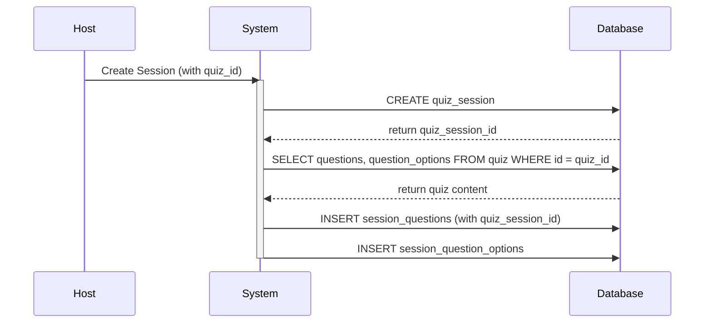
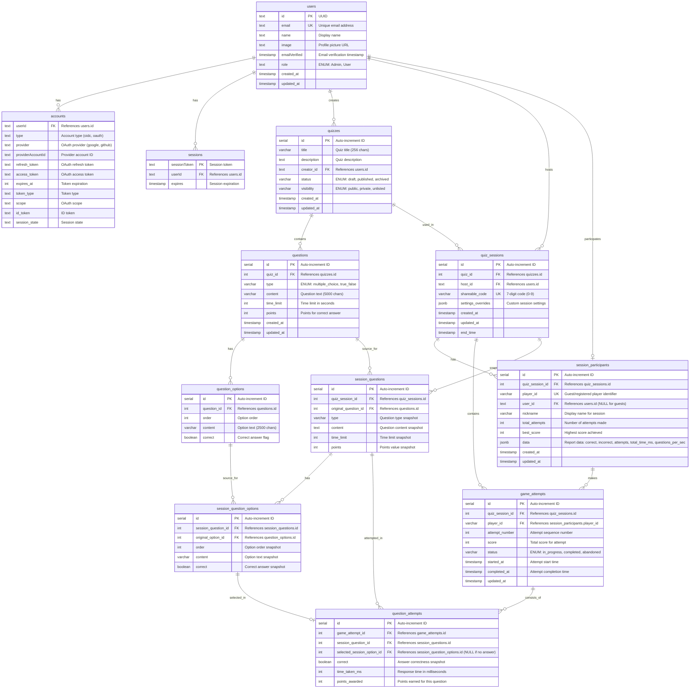
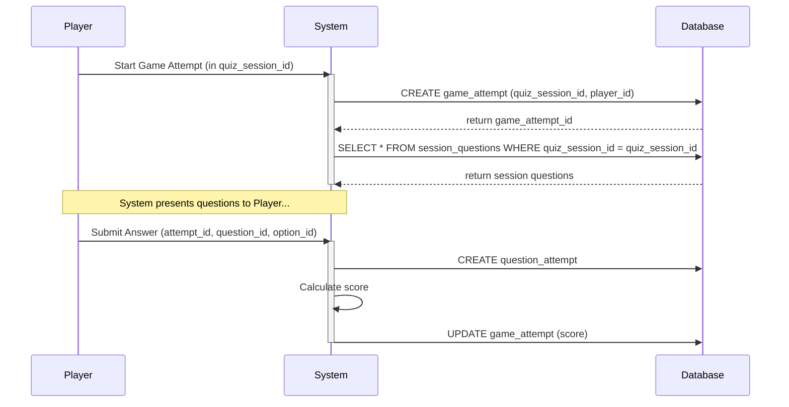

# Báo cáo Dự án: Quiz Learn

## 1. Bảng phân chia công việc chi tiết

Dưới đây là bảng phân chia công việc chi tiết cho từng thành viên dựa trên tệp [`PlanAndTodo.md`](PlanAndTodo.md).

| Tên                  | GitHub Username | Chuyên môn                    | Nhiệm vụ chi tiết                                                                                                                                                                                                                                                                                                                                                                                |
| :------------------- | :-------------- | :---------------------------- | :----------------------------------------------------------------------------------------------------------------------------------------------------------------------------------------------------------------------------------------------------------------------------------------------------------------------------------------------------------------------------------------------- |
| **Trần Thành Long**  | `nielpattin`    | Backend/Core Systems/Database | **Thiết lập dự án:** Auth.js, PostgreSQL & Drizzle ORM, cấu trúc SvelteKit, env, linting. **Hệ thống Authentication:** Quản lý vai trò (User/Admin), protected routes, admin panel. **Database:** Thiết kế schema (10+ bảng), 18+ migrations, seeding script. **Core Backend Logic:** Logic tạo và quản lý quiz, quản lý session, hệ thống tính điểm và lưu trữ kết quả.                |
| **Vương Quang Quý**  | `akitosuref`    | Quiz Management UI            | **Quiz Editor:** Giao diện chỉnh sửa câu hỏi, cài đặt quiz (thời gian, điểm), quản lý câu hỏi và đáp án. **Quiz Player Interface:** Giao diện hiển thị câu hỏi, timer, thanh tiến trình, flow hoàn thành quiz, và trang hiển thị kết quả. **Quiz Management:** Các hành động với quiz (Start Session, Edit, Delete), quản lý trạng thái (draft, published, archived).                      |
| **Nguyễn Xuân Mạnh** | `xuanmanh-2110` | Auth & Results UI             | **Landing Pages & Authentication:** Landing page, trang đăng nhập với Google/Github OAuth, trang profile người dùng. **Join & Participation:** Giao diện nhập code, sảnh chờ session. **Library Interface:** Thư viện quiz với filter, sắp xếp, tìm kiếm, và pagination. **Basic Results Interface:** Giao diện xem kết quả cá nhân và review từng câu hỏi.                             |
| **Vũ Văn Sơn**       | `sunyn582`      | Dashboard & Sessions UI       | **Dashboard Infrastructure:** Layout chính, sidebar, header. **Dashboard Features:** Welcome section, trending quizzes, thanh tìm kiếm, hoạt động gần đây. **Sessions Management:** Giao diện liệt kê, chi tiết, và tạo session; quản lý người tham gia và theo dõi trạng thái session. **Reports Interface:** Giao diện xem báo cáo theo session và theo dõi hiệu suất người tham gia. |

---

## 2. Phân tích yêu cầu

### a. Đặt vấn đề bài toán

Dự án nhằm mục đích phát triển một ứng dụng web trắc nghiệm tương tác (Quiz Web App) tương tự như Quizizz và Kahoot. Ứng dụng cho phép người dùng tạo, quản lý, chia sẻ và tham gia các bài quiz một cách linh hoạt. Mục tiêu là cung cấp một nền tảng dễ sử dụng, có tính tương tác cao, hoạt động ổn định và có khả năng mở rộng trong tương lai.

### b. Tác nhân, người dùng

Hệ thống có hai vai trò chính:

1.  **User (Người dùng):**
    - **Người tạo Quiz (Host):** Có quyền tạo, quản lý, và chia sẻ các quiz của riêng mình. Họ có thể tạo các "self-paced sessions" và xem báo cáo, thống kê từ các session đó.
    - **Người tham gia (Player):** Có thể tham gia vào các quiz thông qua mã mời hoặc link chia sẻ. Họ có thể là người dùng đã đăng ký (lịch sử được lưu lại) hoặc khách (guest).
2.  **Admin (Quản trị viên):**
    - Có quyền quản lý toàn bộ hệ thống, bao gồm quản lý tất cả người dùng và các quiz được tạo trên nền tảng.

### c. Chức năng, phân tích chức năng (theo tác nhân)

#### Chức năng dành cho User (Host & Player)

- **FR1: Quản lý người dùng**
  - Đăng nhập/Đăng ký bằng tài khoản Google.
  - Tự động tạo tài khoản khi đăng nhập lần đầu.
  - Quản lý thông tin cá nhân cơ bản.
- **FR2: Quản lý Quiz (Host)**
  - Tạo quiz mới với tiêu đề, mô tả.
  - Thêm câu hỏi (trắc nghiệm nhiều lựa chọn, đúng/sai) và hình ảnh.
  - Thiết lập thời gian, điểm số cho từng câu hỏi.
  - Chỉnh sửa, xóa, và quản lý các quiz đã tạo.
- **FR3: Tham gia Quiz (Player)**
  - Tham gia bằng mã mời hoặc link.
  - Có thể tham gia với tư cách khách (guest) bằng nickname.
  - Trả lời câu hỏi trong thời gian giới hạn.
  - Xem kết quả và lịch sử làm bài (chỉ dành cho người dùng đã đăng ký).
  - Được phép làm lại nhiều lần trong các "self-paced sessions" cho đến khi hết hạn.
- **FR4: Dashboard & Active Sessions (Host)**
  - Xem danh sách các session đang hoạt động.
  - Xem thông tin chi tiết: trạng thái, thời gian kết thúc, số người tham gia.
  - Gia hạn hoặc kết thúc session sớm.
- **FR5: Báo cáo (Host & Player)**
  - **Host:** Xem thống kê tổng quan về số người tham gia, điểm trung bình, và hiệu suất của từng người chơi trong session.
  - **Player:** Xem lịch sử các quiz đã tham gia và điểm số của mình.

#### Chức năng dành cho Admin

- **FR1.4: Phân quyền**
  - Quản lý toàn bộ người dùng và quiz trong hệ thống.

---

## 3. Đặc tả và thiết kế

### a. Usecase và mô tả

| Usecase              | Mô tả                                                                                                                                                                                                                                |
| :------------------- | :----------------------------------------------------------------------------------------------------------------------------------------------------------------------------------------------------------------------------------- |
| **Quản lý Quiz**     | Người dùng có thể tạo một quiz mới, thêm các câu hỏi thuộc loại trắc nghiệm hoặc đúng/sai, đính kèm hình ảnh, thiết lập điểm số và thời gian cho mỗi câu. Họ cũng có thể chỉnh sửa, xóa và sắp xếp các quiz trong thư viện của mình. |
| **Tổ chức Session**  | Từ một quiz đã tạo, người dùng (Host) có thể khởi tạo một "self-paced session", thiết lập thời gian kết thúc và nhận một mã mời hoặc link để chia sẻ cho người khác.                                                                 |
| **Tham gia Session** | Người tham gia (Player) sử dụng mã mời hoặc link để truy cập vào session. Họ nhập một nickname và có thể bắt đầu làm bài. Hệ thống cho phép làm lại nhiều lần cho đến khi session hết hạn.                                           |
| **Xem báo cáo**      | Host có thể xem báo cáo chi tiết của một session, bao gồm danh sách người tham gia, số lần thử, và điểm số cao nhất. Player có thể xem lại lịch sử các lần làm bài của mình để so sánh tiến độ.                                      |

### b. Flow chi tiết: Luồng tạo Session và Snapshot câu hỏi

Dưới đây là sơ đồ sequence mô tả chi tiết luồng xử lý khi một Host tạo session mới. Hệ thống sẽ "chụp lại" (snapshot) toàn bộ nội dung của quiz tại thời điểm đó để đảm bảo tính toàn vẹn, ngay cả khi quiz gốc bị chỉnh sửa sau này.

### c. Thiết kế hướng đối tượng (Sơ đồ quan hệ thực thể)

Sơ đồ ERD dưới đây mô tả các thực thể chính và mối quan hệ giữa chúng trong cơ sở dữ liệu, thể hiện thiết kế hướng đối tượng của hệ thống.

### d. Data flow và cơ sở dữ liệu

Luồng dữ liệu và cơ sở dữ liệu được thể hiện qua hai sơ đồ chính:

1.  **Sơ đồ ERD (ở mục 3c):** Mô tả cấu trúc và các mối quan hệ của cơ sở dữ liệu PostgreSQL.
2.  **Sơ đồ Sequence (ở mục 3b):** Minh họa luồng dữ liệu tương tác giữa người dùng, hệ thống và cơ sở dữ liệu trong một kịch bản cụ thể (tạo session).

Ngoài ra, luồng dữ liệu khi người chơi làm bài cũng rất quan trọng:

